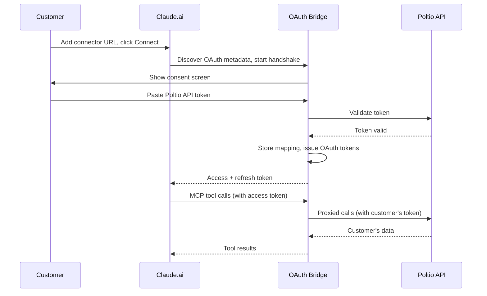

## Summary

Add a self-serve OAuth 2.1 bridge in front of the Poltio MCP server so that any Poltio customer can connect to it from Claude.ai's web-based custom connectors using their own account — authenticating by pasting a Poltio API token they generate themselves, never a password. Alongside it, bring `smithery.yaml` in line with the server's actual transport.

## Problem Frame

The server today ships as a compiled binary for stdio-based clients (Claude Desktop, Gemini CLI), each instance running under one person's `POLTIO_API_TOKEN`. A `PORT`-based HTTP mode is being added (`main.go`, uncommitted) so the server can run as a hosted, browser-reachable endpoint — but it authenticates by checking every request's `Authorization` header against the single token the server started with. That model only works if one person, with one Poltio account, is the sole consumer.

"Publish to Claude so people can use it from a browser" means Claude.ai's custom connectors feature, and that feature is stricter than it looks: Claude's "Add custom connector" screen only exposes OAuth client ID/secret fields — there is no way to enter a bearer token or custom header, and Anthropic's own docs state plainly that "user-pasted bearer tokens are not currently supported." A single shared token, or a token pasted directly into Claude's UI, simply cannot reach this server. Reaching "any Poltio customer, self-serve, from their browser" requires the server to speak the one protocol Claude's connector UI actually understands: OAuth.

Poltio has no OAuth provider of its own — only API tokens with user-set expiration, created from the account panel. So the gap isn't a missing feature on Poltio's side to wire up; it's a small translation layer this project needs to build and operate itself.

## Key Decisions

- **Build a bridge, not borrow an alternative.** Two lighter shapes were considered — letting customers paste their existing token directly (blocked: Claude's UI has no field for it), and per-customer "capability URLs" that encode identity in the connector URL itself (workable, but URLs-as-credentials leak through browser history and logs, and would never qualify for Anthropic's connector directory). An OAuth 2.1 bridge is the only shape that is both reachable through Claude's native UI today and compatible with directory submission later, if that ever becomes a goal.
- **Consent means pasting a token, never logging in.** The bridge's authorization screen asks the customer to generate a Poltio API token from their own account panel (the existing self-serve flow) and paste it in. The bridge never collects, sees, or stores a Poltio username or password — keeping the credential surface to "a token the customer explicitly chose to share, with whatever expiry they set," not "the keys to their account."
- **Expired access gets its own message, not a generic error.** When a stored Poltio token stops working, the customer sees a distinct "your Poltio access has expired — reconnect to continue" prompt rather than an opaque tool failure. This costs more to build (the bridge has to recognize this specific failure mode and route it differently) but is the difference between a customer who self-recovers and one who files a confused support ticket.

## Actors

- A1. **Poltio customer** — has a Poltio account, generates their own API token from the account panel, and authorizes Claude to act on their behalf through the bridge's consent screen.
- A2. **Claude.ai (connector client)** — discovers the bridge's OAuth endpoints, drives the authorization-code + PKCE handshake, and attaches the issued access token to every subsequent MCP request.
- A3. **OAuth bridge** (this project) — hosts the consent screen, issues and refreshes OAuth tokens, stores the mapping from each issued token to a customer's Poltio API token, and uses that mapping to scope MCP tool calls to the right account.
- A4. **Poltio platform API** — validates the customer's token on each call and returns that customer's data; has no awareness that Claude or the bridge exists.

## Key Flows

- F1. **First-time connection**
  - **Trigger:** Customer adds the connector's URL in Claude.ai and clicks "Connect."
  - **Actors:** A1, A2, A3
  - **Steps:** Claude discovers the bridge's OAuth metadata and starts the handshake → the customer is shown the bridge's consent screen → the customer pastes a Poltio API token they generated from their panel → the bridge validates that token against the Poltio platform, stores the mapping, and issues an OAuth access/refresh token pair → Claude completes the handshake and attaches the access token to subsequent MCP requests.
  - **Outcome:** The customer's Claude session can call Poltio MCP tools scoped to their own account.
  - **Covers:** R1, R2, R3, R4

- F2. **Reconnecting after expiry**
  - **Trigger:** A stored Poltio token has expired or is rejected by the Poltio platform mid-session.
  - **Actors:** A1, A2, A3, A4
  - **Steps:** A tool call fails with an expired/invalid-token response from Poltio → the bridge recognizes this as distinct from a generic API error → it surfaces a "your Poltio access has expired — reconnect to continue" message back through Claude → the customer re-enters the consent flow (F1) with a freshly generated token.
  - **Outcome:** The customer regains access on their own, without mistaking expiry for a broken tool.
  - **Covers:** R5

## Requirements

**Authentication and identity**

- R1. The server hosts OAuth 2.1 (with PKCE) endpoints, including Protected Resource Metadata at the well-known location, sufficient for Claude.ai to discover and complete its custom-connector authorization handshake against this server.
- R2. The authorization step presents a consent screen where the customer pastes a Poltio API token generated from their own account panel; the bridge never asks for or stores a Poltio username or password.
- R3. After consent, the bridge issues the customer an OAuth access/refresh token pair that internally maps to the Poltio token they submitted, and uses that mapping to scope every subsequent tool call in that session to their account.
- R4. The bridge persists the mapping between issued OAuth tokens and customers' Poltio tokens, replacing the single-shared-token check the current HTTP mode uses.
- R5. When a stored Poltio token has expired or is rejected by the Poltio platform, the bridge surfaces a distinct "your Poltio access has expired — reconnect to continue" message and routes the customer back through the authorization step, rather than returning a generic tool error.
- R6. Organization resolution moves from a single value fixed at server startup to a per-session lookup: each authenticated customer's session resolves and operates against their own organizations.

**Distribution**

- R7. `smithery.yaml` accurately describes how the deployed server can actually be reached and authenticated — replacing the current declaration, which still describes a stdio transport the HTTP-mode work has moved past.

## Scope Boundaries

**Deferred for later**

- Submitting to Anthropic's connector directory. The OAuth approach is chosen partly because it keeps that path open, but pursuing the listing itself — a test account, Anthropic's review, stricter submission requirements — is not part of this work.
- The CI and test-coverage gaps surfaced while reviewing the project (no test run gates pull requests; most tool files have no tests). Real, but independent of this effort.

**Outside this project's identity**

- Acting as a general-purpose identity provider. The bridge exists solely to translate between Claude's OAuth expectation and Poltio's token model — it is not a login system, an account-management surface, or a credential vault for anything beyond this connection.

## Dependencies / Assumptions

- Poltio has no OAuth provider and no plans assumed here to build one — only user-created API tokens with self-set expiration. The bridge is designed around that reality, not as a stopgap until Poltio gets native OAuth.
- This project builds and operates the bridge itself; nothing here depends on changes to Poltio's core platform.
- Operating the bridge changes what kind of project this is: from a stateless binary that wraps an API into a small hosted service that stores customer credentials, serves a consent UI, and carries real uptime and security obligations. That shift in responsibility is accepted as part of this decision, not a side effect to manage around later.
- This is a forward bet: no Poltio customer has asked for Claude or AI-assisted access yet. The goal is to be positioned for that demand, not to respond to it.

## Success Criteria

- A customer can go from clicking "Connect" in Claude.ai to making a successful Poltio tool call without any manual involvement from the Poltio team.
- A customer whose access has expired can recover on their own by following the reconnect prompt, without contacting support.

## Outstanding Questions

**Deferred to Planning**

- What should `smithery.yaml` actually describe once this ships — the OAuth-bridge HTTP path, a simpler stdio + personal-token path, or both? This depends on what Smithery's platform currently supports for each transport and auth shape, which is worth checking directly rather than assuming.

## Sources / Research

- [Build custom connectors via remote MCP servers](https://support.claude.com/en/articles/11503834-build-custom-connectors-via-remote-mcp-servers) — Claude Help Center confirmation that the custom-connector UI exposes only OAuth client ID/secret fields and that user-pasted bearer tokens are not supported.
- [Cannot configure Authorization: Bearer for custom remote MCP](https://github.com/anthropics/claude-ai-mcp/issues/112) — another developer hitting the same limitation, corroborating that no bearer-token or custom-header path exists in the connector UI.
- [Submitting to the Connectors Directory](https://claude.com/docs/connectors/building/submission) — directory listing requires Protected Resource Metadata at `/.well-known/oauth-protected-resource` and OAuth 2.1 with PKCE; the bar this approach is shaped to be able to clear later.
- `main.go` — current HTTP mode and its single-shared-token `Authorization` check (the mechanism this work replaces).
- `smithery.yaml` — current `type: stdio` declaration, now out of step with the HTTP transport under active development.
