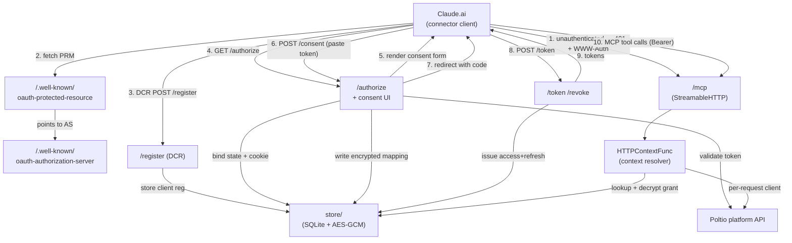

# feat: OAuth 2.1 bridge for Claude.ai custom connector access

## Summary

This plan adds an OAuth 2.1 + PKCE authorization server and encrypted per-customer token-mapping layer in front of the existing MCP server, making it self-serve reachable through Claude.ai's web-based custom connectors. Any Poltio customer can authorize Claude by pasting a self-generated Poltio API token into a consent screen; the bridge handles grant lifecycle, per-session org resolution, reconnect flows, and revocation without any Poltio team involvement.

---

## Problem Frame

The server currently runs as a stateless binary with one shared `POLTIO_API_TOKEN` baked in at startup. Claude.ai's custom-connector UI exposes only OAuth client ID/secret fields — there is no way to enter a bearer token directly — so the single-token model cannot serve multiple customers through Claude's browser interface.

Poltio has no OAuth provider of its own; only user-created API tokens with self-set expiry. The gap is a translation layer this project must build and host: an OAuth 2.1 authorization server that translates Claude's required handshake into Poltio's token model, stores the mapping durably, and handles the full lifecycle including expiry and disconnect.

---

## Requirements

**Authentication and identity**

- R1. The server hosts OAuth 2.1 (with PKCE) endpoints — including Protected Resource Metadata at the well-known location, Authorization Server Metadata, and Dynamic Client Registration — sufficient for Claude.ai to discover and complete its custom-connector authorization handshake.
- R2. The authorization step presents a consent screen where the customer pastes a Poltio API token generated from their own account panel; the bridge never asks for or stores a Poltio username or password.
- R3. After consent, the bridge issues the customer an OAuth access/refresh token pair that internally maps to the Poltio token they submitted, and uses that mapping to scope every subsequent tool call in that session to their account.
- R4. The bridge persists the mapping between issued OAuth tokens and customers' encrypted Poltio tokens, replacing the single-shared-token check the current HTTP mode uses.
- R5. When a stored Poltio token is rejected by the Poltio platform (expired or revoked — the API cannot distinguish them), the bridge surfaces a "your Poltio access has expired or was revoked — reconnect to continue" message distinct from generic tool errors or transient API-down conditions.
- R6. Organization resolution moves from a single value fixed at server startup to a per-session lookup: each authenticated session defaults to the customer's first organization (ordered by `last_used_at` desc, mirroring current startup behavior); `switch_organization` is available as an in-session override and its effect is scoped to the session, not the process.
- R7. A single shared classification function distinguishes Poltio 401/auth-rejection (routes to reconnect or invalid-token messaging) from 5xx/transport failure (routes to "Poltio is temporarily unavailable, try again shortly"). This function governs both consent-time token validation and runtime tool-call error detection, so the customer-facing message family is consistent across both contexts.
- R8. The consent flow binds the pending authorization state to a server-side session via a signed `__Host-` prefixed cookie; the consent POST-back validates that the cookie and the submitted `state` match the original authorization request.
- R9. The Dynamic Client Registration endpoint validates registered redirect URIs against an allowlist (scheme, host, and path prefix); registrations with unrecognized or unvalidated callback destinations are rejected.
- R10. An OAuth revocation endpoint removes the bridge's stored mapping and invalidates the grant when invoked; it does not cascade to Poltio-side token revocation.

**Distribution**

- R11. `smithery.yaml`'s `type: stdio` block is verified accurate for the binary-based desktop deployment path. A README section documents the OAuth-bridge HTTP deployment: required environment variables, and how to publish the hosted connector via Smithery's URL-based registration (that path does not use `smithery.yaml`).

---

## Key Technical Decisions

- **Hand-build the OAuth layer on Go stdlib, not adopt an OAuth-server library.** `ory/fosite` (the most security-focused Go OAuth library) does not implement Dynamic Client Registration — the hardest part of the surface. Adopting it would add a heavyweight dependency while still requiring hand-building DCR, consent-session binding, and redirect-URI allowlisting: the exact pieces where real production MCP servers have been breached. The FastMCP OAuth Proxy (the closest architectural prior art for this pattern) uses an equivalent stdlib + thin-session-layer approach. [Sources: ory/fosite README; FastMCP OAuth Proxy docs; Obsidian Security MCP breach postmortem]

- **Token factory pattern: bridge-issued tokens reference encrypted Poltio credentials via server-side record; the Poltio token never leaves the server.** Each issued OAuth access token is opaque; its server-side record holds an AES-256-GCM-encrypted Poltio token. Claude receives a bridge token, not the customer's Poltio credential. This decouples bridge token lifetime from Poltio token lifetime and bounds credential exposure to the bridge's storage layer. [Sources: FastMCP OAuth Proxy "token factory" design; RFC 8693 Token Exchange taxonomy]

- **SQLite + application-level AES-256-GCM field encryption for persistence.** The project currently has no persistence layer. SQLite (embedded, no external infra) keeps the operational footprint close to today's single-binary shape. The Poltio token field is encrypted with a single master key from a `BRIDGE_ENCRYPTION_KEY` env var (swappable to KMS later). Envelope/per-record DEK encryption is deferred — AES-256-GCM at <1ms overhead does not warrant that complexity at V1 scale. V1 ships without key rotation: rotating the key invalidates all stored mappings; every customer must reconnect. [Sources: HashiCorp Vault barrier_aes_gcm.go; FastMCP encrypted-disk default]

- **Per-request Poltio client context, not a shared mutable client instance.** `PoltioClient.orgID` in `client/client.go` is mutex-guarded mutable shared state. Under multi-tenancy, reusing one process-global client means a concurrent `switch_organization` call can silently write one customer's org ID into another customer's in-flight request. The bridge resolves (decrypted Poltio token, org ID) per-request from the grant record and passes these values as immutable parameters — either constructing a context-scoped client or threading them via typed context keys. [Source: `client/client.go` orgID mutex; `tools/organizations.go` SwitchOrganization]

- **Collapse expired + revoked + malformed-token Poltio responses into one reconnect prompt.** Poltio's `Unauthorized` response schema (`platform.yaml` line 4402) is `{message: string}` with no machine-readable subcode — "invalid or expired or not enough permission" are one 401 bucket. The bridge cannot distinguish them and should not pretend otherwise. 5xx and transport failures are classified separately as "temporarily unavailable" using typed sentinel errors in `client/client.go` (`ErrPoltioUnauthorized` for 401/403-auth-semantics, `ErrPoltioUnavailable` for 5xx and transport). [Source: `platform.yaml` Unauthorized schema; `client/client.go` `do()` method]

- **Default org for new sessions is `orgs[0]`; `switch_organization` becomes session-scoped.** The org list from `/platform/account/profile` is ordered by `last_used_at` descending — the same heuristic `main.go` uses at startup today. An in-consent org picker is deferred. Customers with multiple orgs use the existing `switch_organization` tool after connecting; its effect must be scoped to the requesting session, not the process.

- **Disconnect deletes the bridge's local mapping only; does not call Poltio's `/platform/auth/logout`.** The customer created their Poltio token themselves, may be using it in other contexts, and set its expiry deliberately. The bridge forgetting the mapping is sufficient. [Source: `platform.yaml` line 237, `/platform/auth/logout` endpoint]

- **`smithery.yaml`'s `type: stdio` block requires no changes.** Smithery's current model for hosted HTTP servers with their own OAuth is "bring your own hosting" — the operator registers a public HTTPS URL directly at `smithery.ai/new`; `smithery.yaml` is not involved in that path. The stdio block it describes remains valid for Claude Desktop and Gemini CLI users. [Source: Smithery publish documentation]

---

## High-Level Technical Design

### Component topology



### OAuth grant lifecycle

```mermaid
stateDiagram-v2
  [*] --> Pending: POST /consent creates grant (poltio_token_enc stored; grant_state=pending)
  Pending --> Active: POST /token exchange (PKCE verified; auth code consumed)
  Pending --> [*]: consent TTL sweep (auth code expired or never exchanged)
  Active --> Active: POST /token refresh rotation
  Active --> NeedsReconnect: Poltio API returns 401 (poltio_token_enc nulled at state entry)
  Active --> Revoked: POST /revoke
  NeedsReconnect --> Revoked: POST /revoke
  NeedsReconnect --> [*]: retention window sweep
  Revoked --> [*]: sweep removes record
```



Reconnect creates a new grant via the full consent flow; the old `NeedsReconnect` grant is eventually removed by the retention window sweep.

---

## Output Structure

```
oauth/
  metadata.go           # PRM + AS metadata handlers; 401+WWW-Authenticate on /mcp
  register.go           # DCR endpoint; redirect-URI allowlist; rate limiting; sweep
  authorize.go          # /authorize handler; PKCE + state validation; session binding
  consent.go            # consent form handler; Poltio token validation; auth-code issuance
  token.go              # /token handler; token factory; refresh rotation
  revoke.go             # /revoke handler
  middleware.go         # tool handler middleware for reconnect detection
  templates/
    consent.html        # consent screen form

store/
  db.go                 # SQLite open (WAL mode) + embedded migration
  crypto.go             # AES-256-GCM encrypt/decrypt for Poltio token field
  clients.go            # DCR client registration CRUD + TTL sweep
  grants.go             # auth codes + grant state CRUD + sweep; MarkNeedsReconnect
  mappings.go           # OAuth-token hash → grant lookup
```

Modified files: `main.go` (wire `oauth/` + `store/`; remove bearer-equality wrapper), `client/client.go` (typed sentinel errors; remove shared orgID mutation from multi-tenant path), `tools/organizations.go` (session-scoped `switch_organization`).

---

## System-Wide Impact

This plan changes the project's operational character: from a stateless binary whose worst-case blast radius is one person's Poltio account, to a hosted service storing encrypted third-party credentials for multiple customers. Obligations that did not exist before:

- **Credential storage at rest.** Compromise of the SQLite file and master encryption key leaks every connected customer's Poltio access. The encryption key must be treated as a secret (env var, not committed; rotated on suspected exposure).
- **Uptime obligation.** Customers cannot use Claude to access Poltio if the bridge is down. An SLO exists where none did before.
- **Sweep hygiene.** The sweep covers DCR registrations, expired auth codes, revoked grants, pending grants past the consent TTL, and `needs_reconnect` grants past the retention window. Pending-grant sweep cadence must align with the consent session TTL — a 10-minute consent TTL with an hourly sweep leaves encrypted Poltio tokens in abandoned pending rows for up to 50 minutes past their intended expiry. Without the `needs_reconnect` sweep, every expired Poltio session leaves behind a credential-bearing row with no automatic cleanup.
- **V1 key-rotation and dropped-response limitations.** Rotating `BRIDGE_ENCRYPTION_KEY` forces every connected customer to reconnect simultaneously — there is no selective revocation (see Risks). Additionally, if the HTTP response to a `POST /token` code exchange or refresh rotation is dropped in transit after the transaction commits, the customer's session is unrecoverable without a full reconnect from `/authorize`. This is accepted behavior for V1; document it in the operator runbook so support can instruct affected customers.
- **Decrypt failure signals a key-management incident.** If `WithHTTPContextFunc` cannot decrypt a grant's `poltio_token_enc` (wrong key, AAD mismatch, or corrupted ciphertext), it returns `ErrBridgeDecryptFailure` and logs at ERROR level with the `grant_id`. A single failure may be data corruption; simultaneous failures across multiple grants indicate key drift or a key-compromise event and require operator investigation before further tool calls are served.
- **Minimal audit trail required.** Log grant state transitions (`pending→active`, `active→needs_reconnect`, `active→revoked`, `needs_reconnect→revoked`) with UTC timestamp, `grant_id`, and triggering action. No PII should appear in these log lines. These logs are the only mechanism to scope a credential-exposure incident to affected customers.

---

## Scope Boundaries

### Deferred to follow-up work

- Submitting to Anthropic's connector directory — the OAuth approach is shaped to be directory-eligible, but pursuing the listing (test account, Anthropic review, stricter submission requirements) is outside this plan.
- CI/test-coverage gaps (no test gate on pull requests; most tool files lack tests) — independent of this effort, deferred per the brainstorm.
- Encryption-key rotation without forcing customer reconnection (envelope/per-record DEKs, KMS integration) — accepted as a V1 limitation.
- Org-picker UI in the consent screen for customers with multiple organizations — `switch_organization` serves as the in-session workaround.
- "Manage my connections" customer-facing portal — the revocation endpoint (R10) serves Claude's settings-page disconnect; no self-service UI is built.
- DCR registration-volume and rate-limit tuning beyond the configurable defaults set in U4.

### Outside this project's identity

- Acting as a general-purpose identity provider. The bridge exists solely to translate between Claude's OAuth expectation and Poltio's token model — not as a login system, account-management surface, or credential vault for anything beyond this connection.

---

## Risks and Dependencies

- **Hand-building OAuth is high-stakes.** The Square MCP server breach (one-click account takeover via unrestricted DCR redirect URIs) is a documented incident in this exact space. R8 and R9 exist because of it. Pre-launch self-checklist for the implementer: redirect URIs are exact-match only; auth codes are deleted on first redemption; PKCE verifier is bound to the specific code; token entropy is `crypto/rand` 32 bytes; `/token` returns `invalid_grant` on any reuse or mismatch; no OAuth parameter or Poltio token value appears in logs; `SERVER_URL` must be `https://` (validate at startup; refuse to start in non-dev mode if the scheme is not HTTPS). [Source: Obsidian Security postmortem; RFC 6819 §5]
- **Anthropic's connector spec is externally controlled.** DCR volume behavior, refresh-token rotation semantics, and redirect URI patterns are Anthropic-side details that can change. U3's metadata endpoints are the most likely seam to need updates if the spec evolves.
- **"OAuth completes but `/mcp` never receives `POST initialize`"** is a documented Claude-side failure mode (github.com/anthropics/claude-ai-mcp/issues/291). The bridge cannot fix this, but should log "grant issued, zero MCP requests received within N minutes" as a diagnostic signal to distinguish "our bug" from "Claude-side bug."
- **Poltio API — no subcode on 401.** The `Unauthorized` response schema has no machine-readable subcode. Expired, revoked, and malformed-token causes are one bucket. Accepted (R5 collapses them), but would improve with a platform-level fix.
- **SQLite under concurrent writes.** WAL mode (enabled at `db.go` open time) handles moderate concurrency well. Set `MaxOpenConns=1` for the write connection pool (SQLite serializes writes; more than one open writer produces busy errors that WAL does not eliminate), a `_busy_timeout` pragma (suggested: 5000ms), and a small read-pool ceiling (4–8). Without these, U6's concurrent refresh-rotation race test is fragile.
- **Key compromise is a full-fleet incident in V1.** Rotating `BRIDGE_ENCRYPTION_KEY` in response to suspected exposure forces every connected customer to reconnect simultaneously — there is no selective revocation when all grants share one key. This means a key-compromise incident is also a service-interruption incident for all customers; plan a customer-communication procedure before public launch. The database backup and the `BRIDGE_ENCRYPTION_KEY` backup must be stored in separate locations — co-locating them negates the encryption. Loss of the database file itself forces all customers to reconnect; establish a backup cadence before public launch. This limitation is the primary motivation for per-record DEK encryption (deferred to follow-up work).

---

## Phase 1: Foundation

### U1. Persistence layer

**Goal:** Establish the SQLite schema and AES-256-GCM field encryption that the rest of the bridge depends on.

**Requirements:** R3, R4, R8, R9, R10

**Dependencies:** none

**Files:**
- `store/db.go` (create)
- `store/crypto.go` (create)
- `store/clients.go` (create)
- `store/grants.go` (create)
- `store/mappings.go` (create)

**Approach:** Use `modernc.org/sqlite` as the SQLite driver — the `.goreleaser.yaml` build sets `CGO_ENABLED=0`, which blocks `mattn/go-sqlite3`; `modernc.org/sqlite` is pure-Go and CGO-free. Open SQLite in WAL mode; run embedded migrations (table creation statements) on first open, idempotent on subsequent opens. Four tables: `oauth_clients` (DCR registrations — `client_id`, `redirect_uris_json`, `created_at`, `expires_at`); `auth_codes` (pending consent — `code_hash` SHA-256 of raw code, `client_id`, `pkce_challenge`, `state`, `redirect_uri`, `grant_id` FK, `created_at`, `expires_at`); `oauth_grants` (grant lifecycle — `grant_id`, `access_token_hash`, `refresh_token_hash`, `poltio_token_enc`, `poltio_org_id`, `poltio_account_id`, `grant_state` ENUM `[pending|active|needs_reconnect|revoked]`, `created_at`, `last_used_at`); `pending_consent_sessions` (bound consent-screen state — `session_id`, `client_id`, `redirect_uri`, `code_challenge`, `state`, `created_at`, `expires_at`). `auth_codes.code_hash` stores SHA-256 of the raw code; the raw code is returned once at redirect time and never stored — consistent with the access/refresh token hashing pattern. `auth_codes.grant_id` references the `oauth_grants` row created at consent time (see U5). `crypto.go` wraps `crypto/aes` + `crypto/cipher` GCM: `Encrypt(plaintext, recordID, key []byte) ([]byte, error)` and `Decrypt(ciphertext, recordID, key []byte) ([]byte, error)`; each call generates a fresh `crypto/rand` 12-byte nonce (prepended to ciphertext); `recordID` (the `grant_id` of the row being encrypted) is passed as AAD, binding each ciphertext to its record and preventing a ciphertext-swap attack. Master key read from `BRIDGE_ENCRYPTION_KEY` env var (32-byte hex); process exits with a clear message on startup if absent or malformed.

**Test scenarios:**
- Happy: Encrypt → Decrypt round-trips with same key; plaintext is recovered exactly
- Edge: Decrypt with wrong key returns error, not garbage plaintext
- Edge: empty plaintext encrypts and decrypts correctly
- Error: `BRIDGE_ENCRYPTION_KEY` absent at process start → startup exits with actionable message
- Happy: `db.go` open + migrate on empty file creates all four tables; second open is idempotent (no duplicate-column errors)
- Integration: write grant record with encrypted Poltio token; read it back; decrypt; values match

**Verification:** `go test ./store/...` passes; inspect table schema with `.schema` in SQLite CLI against the created file.

---

### U2. Multi-tenant client refactor

**Goal:** Replace the shared-mutable `PoltioClient` singleton with a per-request execution pattern, add typed sentinel errors for Poltio 401 vs. 5xx, and make `switch_organization`'s effect session-scoped.

**Requirements:** R5, R6, R7

**Dependencies:** none (can be developed in parallel with U1)

**Files:**
- `client/client.go` (modify)
- `tools/organizations.go` (modify)
- `main.go` (minor — remove process-global `SetOrgID` from startup when `PORT` is set)

**Approach:** Define typed sentinel errors in `client/client.go`: `ErrPoltioUnauthorized` (any 401 response) and `ErrPoltioUnavailable` (5xx responses and transport failures — connection errors, timeouts). The `do()` method returns these instead of generic `fmt.Errorf` strings. Also define `ErrBridgeDecryptFailure` for the case where `WithHTTPContextFunc` cannot decrypt an active grant's `poltio_token_enc` (wrong key, AAD mismatch, or corrupted ciphertext); this is distinct from Poltio API errors, routes to an ERROR-level log entry naming the `grant_id`, and is treated as an operator incident rather than a customer action item — simultaneous occurrences across multiple grants are the operational signature of a key-management incident. Add a context-key mechanism for threading `(poltioToken, poltioOrgID)` per request. **Chosen approach: construct a new `*PoltioClient` per request** in `WithHTTPContextFunc` (U7) using the decrypted token from the grant record — matching the shape of `client.NewForTest(token, orgID, baseURL)`. Store the fully-constructed per-request client under a typed context key so all tool handlers call `clientFromContext(ctx)` instead of the singleton `c`. `SwitchOrganization` in `tools/organizations.go` writes the new org ID back to an **`org_override` column on the `oauth_grants` row** (DB-backed, durable across requests) rather than calling `c.SetOrgID(...)` on a shared client; `WithHTTPContextFunc` reads `org_override` (if non-null) over `poltio_org_id` when constructing the per-request client. When `PORT` is set, `main.go` startup no longer hard-exits on missing `POLTIO_API_TOKEN` — the OAuth bridge mode resolves credentials per-request.

**Patterns to follow:** `client.NewForTest` at `client/client.go:~29`; context-value pattern already present in `server.WithHTTPContextFunc`.

**Test scenarios:**
- Happy: `do()` with a 401 response from Poltio returns `ErrPoltioUnauthorized`
- Happy: `do()` with a 503 response returns `ErrPoltioUnavailable`
- Happy: `do()` with a transport error (connection refused) returns `ErrPoltioUnavailable`
- Concurrency: two goroutines calling tool handlers with different `(token, orgID)` pairs concurrently observe no cross-contamination of values (race detector must pass)
- Edge: `SwitchOrganization` called in session A does not alter the org ID used by session B's in-flight request

**Verification:** `go test -race ./client/... ./tools/...` passes; grep confirms no remaining direct `c.SetOrgID` calls except within `SwitchOrganization`'s session-context write and test helpers.

---

## Phase 2: OAuth Authorization Server

### U3. Discovery and metadata endpoints

**Goal:** Serve the three documents Claude needs to discover the OAuth server and initiate the handshake: Protected Resource Metadata, Authorization Server Metadata, and the mandatory `401` + `WWW-Authenticate` response on unauthenticated `/mcp` requests.

**Requirements:** R1

**Dependencies:** U1 (coexists on the same HTTP server; store not needed here)

**Files:**
- `oauth/metadata.go` (create)
- `main.go` (register handlers; add `SERVER_URL` env var)

**Approach:**
- `GET /.well-known/oauth-protected-resource` → RFC 9728 document: `resource` field must exactly match the user-entered URL (including path) per Anthropic's connector spec. Derive from `SERVER_URL` env var; refuse to start if absent. At startup, validate that `SERVER_URL` begins with `https://`; refuse to bind any port unless `BRIDGE_DEV_MODE=true` is also set (which permits `http://` for local development only). This moves the HTTPS enforcement from the Risks checklist into startup code so it cannot be silently skipped in production.
- `GET /.well-known/oauth-authorization-server` → RFC 8414 document advertising `authorization_endpoint`, `token_endpoint`, `registration_endpoint`, `revocation_endpoint`, `code_challenge_methods_supported: ["S256"]`, `token_endpoint_auth_methods_supported: ["none"]`, `grant_types_supported: ["authorization_code"]`.
- Unauthenticated request to `/mcp` → `401 Unauthorized` with `WWW-Authenticate: Bearer resource_metadata="<SERVER_URL>/.well-known/oauth-protected-resource"`. Claude ignores this header on `200` responses; the `401` is mandatory.

**Test scenarios:**
- Happy: `GET /.well-known/oauth-protected-resource` returns `200` with `Content-Type: application/json`; body's `resource` field equals `SERVER_URL`
- Happy: `GET /.well-known/oauth-authorization-server` body advertises `"S256"` in `code_challenge_methods_supported` and includes `registration_endpoint`
- Happy: unauthenticated `POST /mcp` returns `401` (not `403`) with a `WWW-Authenticate` header containing `resource_metadata`
- Edge: `SERVER_URL` absent at startup → process exits with clear error before binding any port

**Verification:** Fetch both well-known URLs via `curl -v`; confirm the unauthenticated MCP response status and headers manually.

---

### U4. Dynamic Client Registration

**Goal:** Implement the RFC 7591 `/register` endpoint so Claude can register itself dynamically; enforce redirect-URI allowlisting, rate limiting, and a TTL-based sweep for unclaimed registrations.

**Requirements:** R1, R9

**Dependencies:** U1 (`store/clients.go`)

**Files:**
- `oauth/register.go` (create)
- `store/clients.go` (extend with sweep logic)
- `main.go` (wire handler; start sweep goroutine)

**Approach:** `POST /register` accepts `application/json` (RFC 7591 §3.1 — must not silently accept form-encoded body; return `415` for wrong content type). Validate `redirect_uris` against an allowlist using **byte-exact comparison after percent-decoding** per OAuth 2.1 §2.1. The allowed set is: `https://claude.ai/api/mcp/auth_callback`, and RFC 8252 loopback URIs where scheme is `http://` and host is `localhost` or `127.0.0.1` (any port, path `/callback`). No glob, prefix, or wildcard matching — each URI must equal an allowlist entry exactly. Reject unrecognized URIs with `400 invalid_redirect_uri`. Note: DCR is intentionally open-registration (no pre-shared secret) because Claude cannot pre-share a secret with a fresh bridge deployment; the redirect-URI allowlist is the primary registration guard. Issue a `client_id` (UUID); store with `expires_at = now + 24h` (configurable). Rate limit: max 20 `/register` calls per IP per minute (configurable); return `429` on excess. Sweep goroutine runs every hour and: (1) deletes `oauth_clients` records past `expires_at` with zero completed grants; (2) deletes `oauth_grants` rows in `grant_state=pending` whose `created_at` exceeds the consent session TTL (aligns sweep with consent expiry — without this, mid-flow crashes leave encrypted Poltio tokens accumulating in pending rows); (3) deletes `oauth_grants` rows in `grant_state=needs_reconnect` past a configurable retention window (default: 30 days). The sweep goroutine recovers from panics (deferred recover + log) and emits a log line with record counts on each run.

**Test scenarios:**
- Happy: valid request with allowed redirect URI → `201 Created` with `client_id`
- Error: `redirect_uri` not in allowlist (e.g., `http://attacker.com/cb`) → `400 invalid_redirect_uri`
- Error: open redirect / relative URI → `400`
- Error: body is `application/x-www-form-urlencoded` instead of JSON → `415`
- Error: registration rate limit exceeded from same IP → `429`
- Integration: register a client; advance time past TTL; run sweep; confirm record deleted from store

**Verification:** `go test ./oauth/... -run TestRegister`; curl an arbitrary `redirect_uri` and confirm rejection.

---

### U5. Authorization and consent

**Goal:** Implement `/authorize` (PKCE validation, session creation, CSRF binding) and the consent form handler (Poltio token validation with retry/backoff, auth-code issuance).

**Requirements:** R1, R2, R5, R7, R8

**Dependencies:** U1, U2 (sentinel errors), U4 (client registration)

**Files:**
- `oauth/authorize.go` (create)
- `oauth/consent.go` (create)
- `oauth/templates/consent.html` (create)
- `store/grants.go` (extend with pending-session state)

**Approach:**
- `GET /authorize`: validate `client_id` (registered), `redirect_uri` (exact match against client's registered URIs — on mismatch, return error directly without redirecting per OAuth 2.1), `response_type=code`, `code_challenge` (S256, non-empty), `state` (non-empty). Generate `session_id`; store `{client_id, redirect_uri, code_challenge, state}` in `pending_consent_sessions` with a short TTL (configurable, default 10 min). Set `__Host-session` cookie (Secure, HttpOnly, SameSite=Strict, max-age matches session TTL). Render consent HTML.
- `POST /consent`: read `__Host-session` cookie; look up pending session; validate state match (CSRF gate — reject without redirect if cookie missing or session not found). Call Poltio `/platform/account/profile` with submitted token. Use the R7 classification function: on `ErrPoltioUnavailable` (retry up to 2 times with backoff; on exhaustion), re-render form with "Poltio is temporarily unavailable, try again shortly." On `ErrPoltioUnauthorized`, re-render form with "This token is invalid or expired — generate a new one from your Poltio account panel." On success: extract `orgs[0]` org ID and account ID; encrypt Poltio token (passing `grant_id` as AAD); create `oauth_grants` row with `poltio_token_enc`, `poltio_org_id`, `poltio_account_id`, `grant_state=pending`; generate a random 32-byte auth code and write SHA-256(code) to `auth_codes.code_hash` with `grant_id` FK, `redirect_uri` (for re-validation at `/token`), and `expires_at = now + 5 min` (the raw code is returned in the redirect and never stored); delete pending session; redirect to client `redirect_uri` with `code` + echoed `state`. The consent POST body must not appear in application logs — log validation status, not the submitted token value.
- Customer closes tab mid-flow → pending session TTL expires; no grant is ever written; storage self-clears.

**Test scenarios:**
- Covers AE1. Happy: full authorization half of AE1 — `/authorize` → consent form renders → `POST /consent` with valid token → redirect with code
- Error: `/authorize` with unregistered `client_id` → redirect with `error=unauthorized_client`
- Error: `/authorize` with `redirect_uri` not matching registered value → return error directly (no redirect)
- Error: `POST /consent` with missing `__Host-session` cookie → reject without redirect
- Error: `POST /consent` with valid cookie but tampered `state` → reject
- Error: pasted token returns `401` from Poltio → form re-renders with invalid-token message; no redirect occurs
- Error: pasted token returns `503` from Poltio → form re-renders with "temporarily unavailable" after retries; no redirect occurs
- Edge: account has zero organizations → form re-renders with "your account has no organizations" message
- Edge: pending session TTL expires; subsequent `POST /consent` with that cookie → session-not-found error
- Concurrency: two simultaneous `/authorize` requests with different `client_id` values each get isolated pending sessions

**Verification:** Integration test against `httptest.NewServer` simulating the full Claude connector flow; assert each error branch produces the expected HTTP response and body.

---

### U6. Token endpoint and revocation

**Goal:** Implement `/token` (code exchange, access/refresh issuance with token factory pattern, refresh rotation) and `/revoke` (grant invalidation).

**Requirements:** R1, R3, R4, R10

**Dependencies:** U1, U5 (auth codes in store)

**Files:**
- `oauth/token.go` (create)
- `oauth/revoke.go` (create)
- `store/grants.go` (extend with grant creation, rotation, revocation)

**Approach:**
- `POST /token` accepts `application/x-www-form-urlencoded` (RFC 6749 §4.1.3 — not JSON; explicitly handle `415` for JSON body — a real gotcha per Anthropic connector docs). Authorization-code exchange: within a single DB transaction — BEGIN; SELECT auth code row by SHA-256(presented code) FOR UPDATE; verify `client_id` matches, `redirect_uri` matches stored `redirect_uri`, PKCE verifier matches `S256(challenge)`, `expires_at` is in the future; DELETE auth code row; flip `grant_state` from `pending` to `active`; issue opaque access token (`crypto/rand` 32 bytes, stored as SHA-256 hash) with a configurable TTL (default: 1 hour; returned as `expires_in`); issue refresh token (`crypto/rand` 32 bytes, stored as hash); write hashes to the grant row; COMMIT. The entire sequence — code lookup, deletion, and grant activation — is atomic, preventing TOCTOU auth-code reuse even under concurrent requests. Return standard token response JSON.
- Refresh rotation: `POST /token` with `grant_type=refresh_token` — look up by refresh-token hash; if the token is found but already-rotated (not merely absent), revoke the entire grant immediately (`grant_state=revoked`) and return `invalid_grant` — this is treated as a token-theft indicator per RFC 6819 §5.2.2.3; if the token is valid, issue new access + refresh pair and invalidate the old refresh-token hash in the same DB transaction. Return `invalid_grant` for absent tokens.
- `POST /revoke` (RFC 7009): accept access or refresh token in form body. Look up grant by token hash; set `grant_state=revoked`; null out `poltio_token_enc`. Revoking either token type revokes the entire grant — the `revoked` state check in `WithHTTPContextFunc` (U7) renders any outstanding access tokens immediately invalid, before their natural expiry. Return `200` even when token not found (per RFC 7009 §2.2).

**Test scenarios:**
- Happy: code exchange returns access + refresh tokens; same code reused → `invalid_grant`
- Happy: refresh rotation issues new pair; old refresh token → `invalid_grant` on second use
- Error: PKCE verifier does not match challenge → `invalid_grant`
- Error: token body sent as JSON → `415`
- Error: `client_id` mismatch in exchange → `invalid_client`
- Covers AE4. Happy: revoke valid access token → `200`; subsequent MCP request with that token → `401`
- Happy: revoke valid refresh token → `200`; subsequent refresh → `invalid_grant`
- Happy: revoke unknown token → `200` (no error)
- Concurrency: two concurrent refresh-rotation attempts on the same refresh token — exactly one succeeds; the other gets `invalid_grant`; no duplicate grant rows created (race detector must pass)

**Verification:** `go test -race ./oauth/... -run TestToken`; confirm `Content-Type: application/json` on token request returns `415`.

---

## Phase 3: Bridge Integration and Reconnect

### U7. MCP request context wiring

**Goal:** Thread per-request Poltio credentials through `server.WithHTTPContextFunc` so all ~142 tool handlers receive the correct customer's token and org via context, replacing the single-bearer-equality check in `main.go`.

**Requirements:** R3, R4, R6

**Dependencies:** U1, U2, U6 (grant records in store)

**Files:**
- `main.go` (replace bearer-equality wrapper; wire `WithHTTPContextFunc` and `WithToolHandlerMiddleware`)
- `tools/organizations.go` (complete session-scoped `switch_organization` from U2)

**Approach:** Register a `server.WithHTTPContextFunc` handler. It extracts `Authorization: Bearer <token>`, hashes it, looks up the grant in `store`, checks `grant_state`: if `active`, decrypts `poltio_token_enc` and stores `(poltioToken, poltioOrgID, grantID)` under typed context keys — decryption failure stores an `ErrBridgeDecryptFailure` sentinel and logs at ERROR level with the `grant_id` (simultaneous failures across multiple grants signal a key-management incident, not a Poltio API issue); if `needs_reconnect` or `revoked`, stores a `needsReconnect` sentinel; if not found, stores a `needsAuth` sentinel. Remove the manual `http.HandlerFunc` bearer-equality wrapper added in `main.go` (lines ~1053–1072). Register a `server.WithToolHandlerMiddleware` that checks the context sentinel before invoking any tool handler — on `needsAuth`, returns a `mcp.NewToolResultError` immediately.

**Patterns to follow:** `server.WithHTTPContextFunc` seam at `server/streamable_http.go:114`; `server.WithToolHandlerMiddleware` at `server/server.go:295`.

**Test scenarios:**
- Happy: request with valid active-grant token → tool handler receives correct `(token, orgID)` from context
- Error: request with unknown token → tool returns auth error without reaching handler logic
- Error: request with revoked token → same as unknown token
- Covers AE3. Integration: two concurrent requests with different valid tokens → each tool invocation sees only its own customer's credentials; no cross-contamination (race detector must pass)

**Verification:** `go test -race ./... -run TestContextWiring`; grep confirms no remaining bearer-equality comparison in `main.go`.

---

### U8. Reconnect detection and distinct error surface

**Goal:** When a tool call encounters `ErrPoltioUnauthorized` during a live session, mark the grant as `needs_reconnect`, short-circuit subsequent calls on that grant, and surface a distinct reconnect message rather than a generic tool error.

**Requirements:** R5, R7

**Dependencies:** U1, U2 (sentinel errors), U7 (context wiring and tool middleware)

**Files:**
- `oauth/middleware.go` (create — reconnect-detection middleware)
- `store/grants.go` (add `MarkNeedsReconnect`)

**Approach:** The tool handler middleware (registered in U7 via `server.Use(mw)`) inspects the tool handler's returned error after execution. If it unwraps to `ErrPoltioUnauthorized`: call `store.MarkNeedsReconnect(grantID)` (idempotent) — `MarkNeedsReconnect` nulls `poltio_token_enc` in the same database write, eliminating long-lived encrypted credentials in the `needs_reconnect` state; return `mcp.NewToolResultError("Your Poltio access has expired or was revoked. Reconnect: <SERVER_URL>/authorize")`. If it unwraps to `ErrPoltioUnavailable`: return `mcp.NewToolResultError("Poltio is temporarily unavailable. Try again shortly.")`. The `U7` context function's `needs_reconnect` state check short-circuits at request time for all subsequent calls on the same grant — avoiding N concurrent tool calls all hitting the same 401 before the first `MarkNeedsReconnect` write completes.

**Test scenarios:**
- Covers AE2. Happy: tool returns `ErrPoltioUnauthorized` → result contains reconnect message; grant state becomes `needs_reconnect`
- Covers AE2. Happy: subsequent request on the same grant → short-circuited at context phase; reconnect message returned without calling Poltio
- Happy: tool returns `ErrPoltioUnavailable` → result contains "temporarily unavailable"; grant state stays `active`
- Error: non-Poltio tool error (e.g., validation) → propagated unchanged; no state mutation
- Concurrency: two concurrent calls on same grant both returning `ErrPoltioUnauthorized` → `MarkNeedsReconnect` is idempotent; no duplicate errors or panics (race detector must pass)

**Verification:** `go test -race ./... -run TestReconnect`; confirm mock-Poltio returning 401 produces the reconnect message string; confirm 503 produces the "temporarily unavailable" string.

---

## Phase 4: Distribution

### U9. Distribution and documentation

**Goal:** Confirm `smithery.yaml` accurately describes the stdio binary path; add a README section documenting the OAuth-bridge HTTP deployment and Smithery URL-based publication.

**Requirements:** R11

**Dependencies:** U7 (full MCP surface must be complete before documenting the hosted connector deployment)

**Files:**
- `smithery.yaml` (review; likely no changes)
- `README.md` (add section)

**Approach:** Read the existing `smithery.yaml`; verify `command: "poltio-mcp-server"`, the `POLTIO_API_TOKEN` mapping, and the configSchema description are still accurate for the stdio binary (they should be — nothing in this plan changes the stdio path). Add a README section: "Deploying as a hosted OAuth connector" covering (1) required env vars (`DATABASE_PATH`, `BRIDGE_ENCRYPTION_KEY`, `SERVER_URL`, `PORT`), (2) Smithery URL-based publishing (`smithery.ai/new` → enter public HTTPS URL), (3) the optional `/.well-known/mcp/server-card.json` static metadata endpoint for a richer Smithery listing.

**Test scenarios:**
- Test expectation: none — this unit is documentation and configuration verification only.

**Verification:** Following only the README's stdio instructions from a fresh checkout, the binary starts with a personal token. Following the hosted-connector section, `GET /.well-known/oauth-protected-resource` and `POST /register` respond as documented.

---

## Acceptance Examples

- AE1. Customer connects for the first time: adds the connector URL in Claude.ai → consent screen opens → pastes a valid Poltio token → Claude tool calls succeed using that customer's Poltio data, not the server operator's.
- AE2. Customer's Poltio token is rejected mid-session: a tool call returns "Your Poltio access has expired or was revoked — reconnect to continue" (not a generic error); all subsequent tool calls in that session return the same message without hitting Poltio again.
- AE3. Two customers with different Poltio accounts connect concurrently: each customer's tool calls see only their own data; neither session observes the other's credentials or org.
- AE4. Customer disconnects via Claude's connector settings: the bridge's stored mapping is removed; subsequent requests with the old access token are rejected with `401`.

---

## Sources and Research

- [Claude.ai connector authentication docs](https://claude.ai/docs/connectors/building/authentication) — authoritative source for 401+WWW-Authenticate discovery flow, PRM/AS metadata required fields, DCR and CIMD behavior, refresh-token rotation requirement, redirect URI patterns (claude.ai callback, RFC 8252 loopback), and Anthropic egress range.
- [FastMCP OAuth Proxy](https://gofastmcp.com/servers/auth/oauth-proxy) — closest architectural prior art: token factory, encrypted upstream-credential storage, dual PKCE, consent-session binding. Reference pattern for KTD2 and the per-unit approach in U5/U6.
- [Obsidian Security: When MCP Meets OAuth](https://www.obsidiansecurity.com/blog/when-mcp-meets-oauth-common-pitfalls-leading-to-one-click-account-takeover) — Square MCP server breach postmortem (unrestricted DCR redirect URIs → one-click account takeover). Direct source for R9 and the CSRF mitigations in R8.
- `platform.yaml` (project root) — Poltio API response schemas: lines 4402–4407 (Unauthorized, `{message: string}`, no subcode) ground KTD5; line 237 (`/platform/auth/logout`) grounds KTD7; line 3304 (`/platform/tokens`, masked, org-header-gated) explains why proactive token-expiry tracking is not available.
- `client/client.go`, `tools/organizations.go` (this repo) — shared-mutable `orgID` field and `SetOrgID` mutation pattern; ground KTD4 and the test scenarios in U2.
- `server/streamable_http.go:114`, `server/server.go:295` (mcp-go v0.54.0) — `WithHTTPContextFunc` and `WithToolHandlerMiddleware` seams; ground U7's approach.
- [github.com/anthropics/claude-ai-mcp/issues/291](https://github.com/anthropics/claude-ai-mcp/issues/291) — "OAuth completes but POST initialize never arrives" failure mode; grounds the diagnostic-logging note in Risks and Dependencies.
- [HashiCorp Vault barrier_aes_gcm.go](https://github.com/hashicorp/vault/blob/main/vault/barrier_aes_gcm.go) — AES-256-GCM field-encryption reference pattern; grounds KTD3.
- [ory/fosite GitHub](https://github.com/ory/fosite) — library capability review; confirms fosite does not include DCR, grounds the hand-build decision (KTD1).
